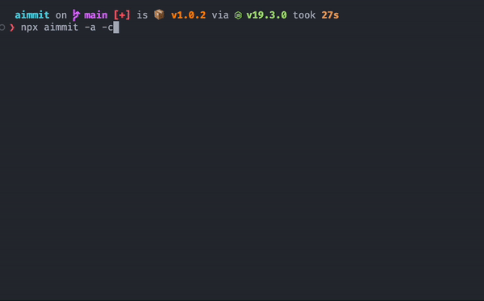

<!-- PROJECT SHIELDS -->

[![NPM Version][npm-version]][npm-url]
[![Contributors][contributors-shield]][contributors-url]
[![Forks][forks-shield]][forks-url]
[![Stargazers][stars-shield]][stars-url]
[![Issues][issues-shield]][issues-url]
[![MIT License][license-shield]][license-url]

[npm-version]: https://img.shields.io/npm/v/aimmit.svg
[npm-url]: https://www.npmjs.com/package/aimmit
[contributors-shield]: https://img.shields.io/github/contributors/Songkeys/aimmit.svg
[contributors-url]: https://github.com/Songkeys/aimmit/graphs/contributors
[forks-shield]: https://img.shields.io/github/forks/Songkeys/aimmit.svg
[forks-url]: https://github.com/Songkeys/aimmit/network/members
[stars-shield]: https://img.shields.io/github/stars/Songkeys/aimmit.svg
[stars-url]: https://github.com/Songkeys/aimmit/stargazers
[issues-shield]: https://img.shields.io/github/issues/Songkeys/aimmit.svg
[issues-url]: https://github.com/Songkeys/aimmit/issues
[license-shield]: https://img.shields.io/github/license/Songkeys/aimmit.svg
[license-url]: https://github.com/Songkeys/aimmit/blob/master/LICENSE.txt

<!-- PROJECT LOGO -->

<br />
<div align="center">

  <h2 align="center">aimmit</h2>

  <p align="center">
    Git commit message generator with AI
  </p>
  
  
</div>

## About The Project

Generate the commit message with AI (ChatGPT).

> This library uses itself to generate the commit message.

## Installation

Option 1: directly use with npx:

```bash
npx aimmit@latest
```

Option 2: install globally then use:

```bash
# install
npm install -g aimmit

# use
aimmit
```

### Set up the AIMMIT_API_KEY [Payment Required]

Before using `aimmit`, you need to set up the `AIMMIT_API_KEY` (i.e. OpenAI API key) environment variable.

```
AIMMIT_API_KEY=... aimmit
```

Or you can set it in the `.bashrc` or `.zshrc` file:

```bash
export AIMMIT_API_KEY=...
```

Or you can specify the API key with the `-k` option:

```bash
aimmit -k ...
```

You can get the API key from [OpenAI](https://openai.com/).

Note that this is a paid service by OpenAI.

### Alternative: Use a Reverse Proxy [Free Depending on the Provider]

Instead of using the official OpenAI paid service, there are some free reverse proxy services available but may have some limitations and of less stability.

Here is one example:

```bash
aimmit -r https://proxy/api
```

Or you can use the environment variable `AIMMIT_REVERSE_PROXY_URL`:

```bash
export AIMMIT_REVERSE_PROXY_URL=...
```

Please note that a reverse proxy service may have security issues. You should use it at your own risk.

A free reverse proxy service is provided by default in this project by me. I promise that it will NOT collect any of your data. However, it may go down at any time.

## Options

Usage:

```bash
Options:
      --help                  Show help                                [boolean]
      --version               Show version number                      [boolean]
  -c, --conventional-commits  Use Conventional Commits[boolean] [default: false]
  -l, --lite                  Only print the commit message
                                                      [boolean] [default: false]
  -a, --auto-add-all          Automatically add all files to the commit
                                                      [boolean] [default: false]
  -p, --auto-push             Automatically push the commit to the remote
                                                      [boolean] [default: false]
  -r, --reverse-proxy-url     Reverse proxy URL                         [string]
  -k, --key                   API key                                   [string]
  -v, --verbose               Run with verbose logging[boolean] [default: false]
```

### Examples

Generate with Conventional Commits:

```bash
aimmit -c
```

Automatically add all files to the commit, then generate with Conventional Commits, then automatically push the commit to the remote:

```bash
aimmit -a -c -p
```

Only print the commit message:

```bash
aimmit -l
```

## Contributing

Contributions are what make the open source community such an amazing place to learn, inspire, and create. Any contributions you make are **greatly appreciated**.

If you have a suggestion that would make this better, please fork the repo and create a pull request. You can also simply open an issue with the tag "enhancement".
Don't forget to give the project a star! Thanks again!

1. Fork the Project
2. Create your Feature Branch (`git checkout -b feature/AmazingFeature`)
3. Commit your Changes (`git commit -m 'Add some AmazingFeature'`)
4. Push to the Branch (`git push origin feature/AmazingFeature`)
5. Open a Pull Request

## Credits

- [Nutlope/aicommits](https://github.com/Nutlope/aicommits): the original project. I made this project because I want to make more customizations and provide a free service option.
- OpenAI: the AI model provider.

## License

Distributed under the MIT License. See [`LICENSE`](LICENSE) for more information.
